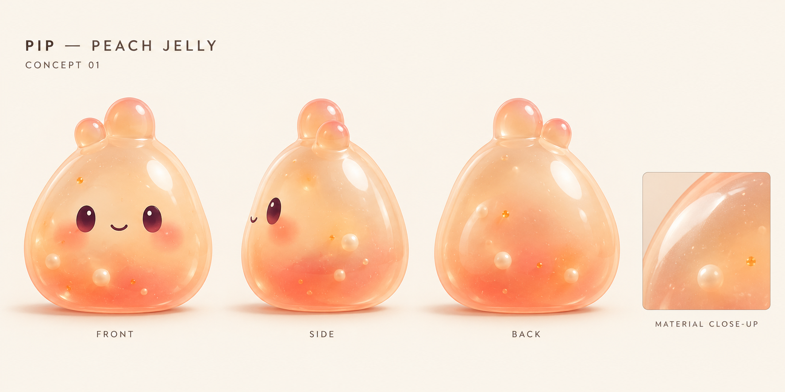
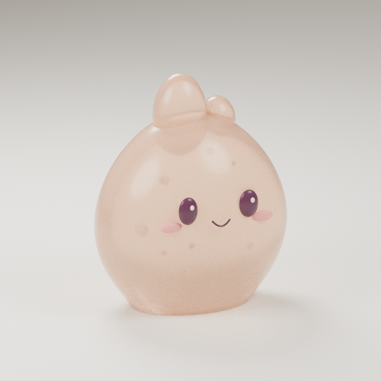

# Character generation

Start with **Pip**, the original peach jelly companion, while the first Android prototype is being validated. Its successful desktop playtest establishes a useful interaction baseline; phone responsiveness and performance still need testing.

## 1. Design reference

The owner approved concept 01. Keep Pip recognizable: a rounded, slightly bottom-heavy seed body, two small unequal crown lobes, plum oval eyes, a tiny smile, peach-coral jelly, and restrained suspended pearls/flecks. The concept sheet establishes visual direction; the first Blender art pass now supplies editable geometry.

Keep a neutral rest pose and a simple silhouette. Small screens must preserve the face and identity. Establish the final material and expression before producing additional characters. All character designs should be original.



This generated draft establishes the peach color, rounded silhouette, and face. Its side view is slightly turned, so refine true orthographic proportions during modeling. Rendered transparency and reflections are visual targets; their mobile shader implementation still needs device validation.

## 2. Reusable Blender base

Build one clean, closed jelly mesh centered around the prototype's coordinate convention: local Y up, front negative Z, base at Y=-1. Keep transforms applied and facial anchors identified. Begin near the current geometry cost rather than spending triangles on detail that can live in materials. The current body has 1,073 vertices / 2,016 triangles; that is a reference budget, not a measured performance guarantee.

Use evenly distributed deformation-friendly topology with outward normals. Check maximum squash and stretch, crown intersections, facial attachment, UV seams, transparency sorting, and the body silhouette from every angle. Save the editable `.blend` source and export FBX for Unity. Generated 3D output must receive the same topology, transform, UV, and performance checks as an authored mesh.

## 3. Unity integration

Import into Unity 6000.6.5f1 using the Built-in Render Pipeline. `PipCharacterImporter` converts `Resources/Pip/Pip.pocklemesh` into a native readable mesh and `PipCharacterAsset`. This source contains Blender-authored positions, triangles, UVs, logical normal-weld groups, face/crown anchors, suspended accents, and color defaults, in explicit Unity coordinates. `JellyToy` copies that native mesh into its owned deformation buffers and uses the same interaction core as the baseline. `Pip.fbx` is also supplied for standard 3D interchange; it does not drive the renderer directly.

Choose **Pockle → Character → Use authored Pip**, then restart Play. Use **Use procedural baseline** to compare the first prototype. The authored model is the default on a fresh installation; missing or unreadable authored assets fall back to the baseline with a Console warning. Inspect the Console after first import: it should report **Pip: authored mesh · 1228 vertices**. Player builds use the native imported asset and need neither Blender nor runtime JSON parsing.

Use a material instance for Pip's peach jelly. Tune translucency and internal accents on Android, including release builds. Prefer shared base geometry and material variants to unique high-cost meshes for every collectible. Character generation happens during asset production; touching a toy should remain entirely local.

## Rebuild the current art pass

The editable scene is `ArtSource/Pip/Pip.blend` (Blender 4.3.2). To regenerate it, the FBX, and the character source from the deterministic recipe:

```sh
blender --background --factory-startup --python-exit-code 1 --python tools/build-pip.py
```

Add `-- --render` to produce the optional offline model study (CPU Cycles, 256 samples, four threads). The recipe creates a complete character with a closed, flat-based body, UVs, plum eyes, smile, asymmetric crown lobes, pearls, and flecks. Standard FBX round-trip validation runs with:

```sh
blender --background --factory-startup --python-exit-code 1 --python tools/check-pip-fbx.py
```

Manual edits to `.blend` do not automatically update the `.pocklemesh` source. Keep topology/anchor edits in the recipe for repeatable export, or extend its exporter before adopting manually sculpted changes. Keep the `.blend` outside `Assets` so Unity does not require a local Blender installation to import the project.



This is an offline Blender material study of the actual geometry. Unity uses its lightweight jelly shader; parity with the approved concept and mobile transparency still require visual testing. Crown lobes remain separate meshes in this first art pass.

## 4. Acceptance gate

Compare the generated/imported asset against the responsive procedural prototype on the same Android phone. Verify press, stretch, rebound, rotation, reset, reveal, settings, and lifecycle interruption. Profile frame time, allocations, draw calls, and memory; inspect the shader and face on the device. Follow `docs/VALIDATION.md` and retain the procedural version if the asset makes the interaction worse.

After one jelly character passes this gate, create one plush and one vinyl base with distinct material responses. Expand toward the suggested 12-collectible roster by reusing those three bases. The collecting beta, editions, evolution, and trading remain separate milestones.
