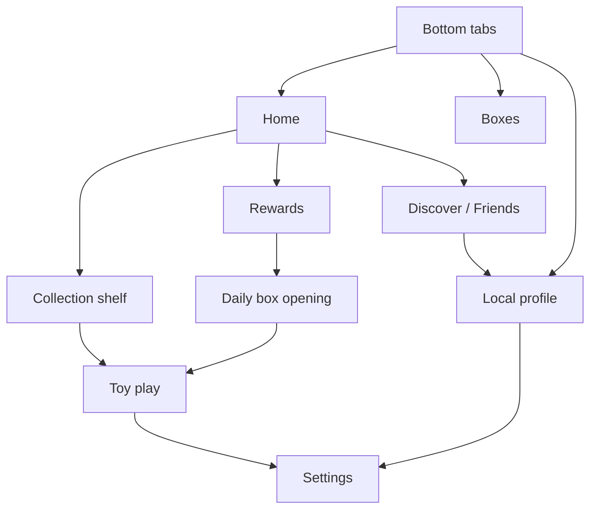
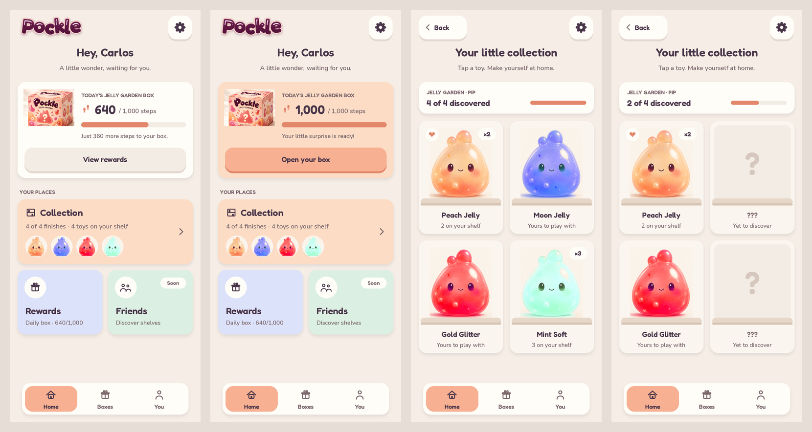

# Home hub UI pass — Home hub 01

This pass implements the first local version of UX-001, UX-003, UX-006, UX-009, and UX-015. It adds entry screens for UX-017/020 without connecting social services. The full task acceptance criteria remain pending device review and the services listed in the tracker.

Pockle opens on **Home**. A personal greeting, daily walking card, and **Collection**, **Rewards**, and **Friends** tiles give the player a next action. The bottom tabs are **Home**, **Boxes**, and **You**. The daily card shows remaining steps, a ready-box action, or a countdown to the next UTC day after a claim.

A shelf toy opens play. **Shelf** or Android Back returns to the same shelf position. Settings opened during play returns to that toy first, then to its shelf. Opening a daily reward routes through the shelf so its revealed toy has the same return path. Selecting a main tab clears the old Back stack; returning to a destination keeps its scroll position for this session. Android Back dismisses a dialog or keyboard first; on Home it exits the Android app. Toy input and the viewer camera stay disabled during all menu screens and dialogs.

## Home and shelf 01 (UX-003/004)

*Design mock drawn with the real fonts, icons, and layout numbers; the toy portraits are stand-ins cut from the concept art. The build renders the actual meshes.*

**Home** leads with **today's box**: the Jelly Garden box art, your steps as a large number with a progress bar, a status line, and one action. While walking, the action is a quiet **View rewards**. When the box is ready, the card warms to peach and the action becomes a primary **Open your box**. After opening, the status shows the countdown to the next UTC day. Below, **Your places** has a full-width **Collection** tile with small portraits of the toys you own, and half tiles for **Rewards** (live daily status) and **Friends** (marked **Soon**). On screens narrower than 300 points the half tiles stack.

The **shelf** opens with a discovery card ("3 of 4 discovered" with a bar). Each collectible has its own cubby with the toy standing on a two-tone ceramic shelf, its name, and an ownership line. Duplicates add a **×N** badge, and your favorite gets a heart. A toy you haven't found shows a **?** cubby and **???** instead of its name, and can't be opened, so finishes stay a surprise. Rows use 1–4 columns by width and center a partial last row. A final row says more collections are on the way, without promising specific content.

: edit a display name, choose one of the four original Pip avatars, select an owned favorite, and play that favorite. Names are trimmed and limited to 20 text elements; display text disables rich-text markup. Avatar, favorite, and name persist under `pockle.profile.local.*`, separately from inventory. Collection totals come from actual saved counts. No account, global username, profile publication, or cloud save is created.

**Settings** has sound mute and a volume slider, haptics, full/calm motion, walking status and an explicit Enable action, play/walking help, save/account information, and an About marker. Volume persists separately from mute, so muting preserves the chosen level. Existing toy and walking settings continue to work. See **Settings → About Pockle** to identify the UI build; it now reads **Home and shelf 01** (see [VISUAL_SYSTEM.md](VISUAL_SYSTEM.md)).

**Rewards** reuses the daily claim card from Boxes, explains the UTC reset and current foreground-walking limitation, and has a clearly unavailable badges/milestones entry. **Friends** has Discover and Friends sections with honest empty states. Real friend connections, public shelves, badge grants, and milestone rewards are still planned. Purchases retain the unavailable checkout behavior.

## Review when back at the phone

1. Close Unity, run `git pull --ff-only origin main`, reopen the same project, press Play, and rebuild/install the APK. Expect Home immediately; check the UI build name in Settings (**Visual system 01** or later) if an older APK is suspected.
2. Open Collection, choose Moon, open Settings, change volume and motion, then use Back. Confirm it returns to Moon, then the same shelf position. Repeat after scrolling on a small or landscape screen.
3. Open You. Change the name, avatar, and favorite. Return Home and check the greeting. Restart the app and confirm those choices and the sound level remain. Check native keyboard dismissal and long names.
4. Open Rewards; test activity permission and daily progress. In the editor, use **Pockle → Testing → Complete today's walk (Play Mode only)**, open once, and confirm the claim/countdown updates on Home and Boxes. Return from the revealed toy to its shelf.
5. Open Friends, switch Discover/Friends, and visit Your profile. Check Back returns to the originating social screen. Nothing should create an account, friend, or additional toy.
6. Check 320×568, 390×844, tablet, landscape, and notched safe areas; scroll to all settings/profile actions. Android Back should dismiss dialogs/keyboard before leaving the screen, then exit only at Home.

Cloud execution covers portable navigation, name handling, geometry, rewards, and C# syntax/asset metadata. The updated Unity PlayMode suite covers profile restart, menu/play Back, volume, shelf scroll, daily claims, and unchanged inventory. It is authored but **not run in cloud**; Unity API compilation, rendering, native keyboard behavior, and the APK require local verification.
