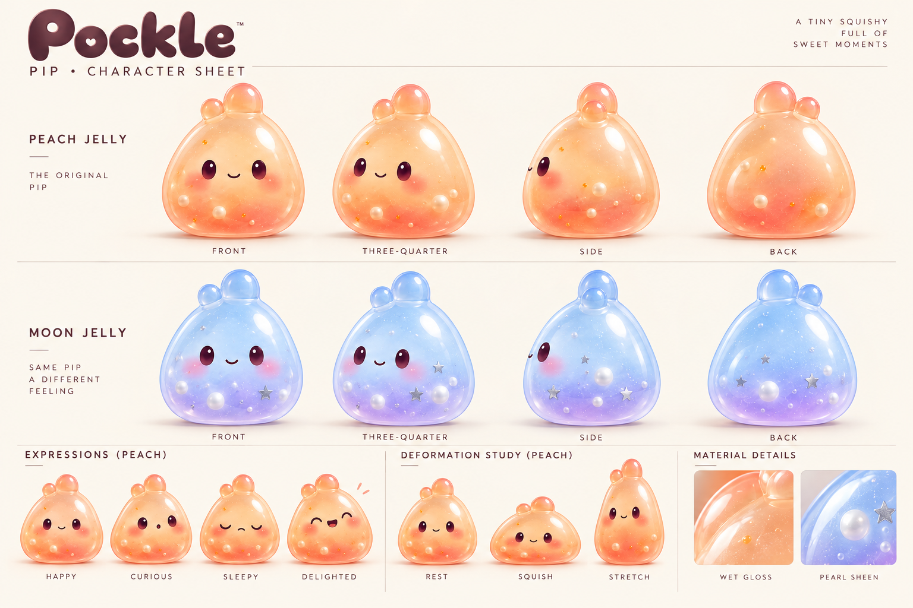

# Pip character sheet

This concept sheet expands the approved Peach Jelly reference into a shared design guide for Peach and Moon. It includes turnarounds, expression ideas, deformation poses, and material details. It is a visual target for further art work; the expression pass now implements Happy, Curious, Sleepy, and Delighted on the runtime face. See [expression testing](../PIP_EXPRESSIONS.md). Rendering and phone feel still need owner review.

Pip keeps one identity across variants: a bottom-heavy rounded jelly body, two unequal crown lobes, plum oval eyes, a small curved smile, and soft blush. Peach has a warm glossy shell with cream pearls and amber flecks. Moon has a blue-to-lavender shell with silver stars, larger icy pearls, and a softer pearl sheen.

Use the sheet alongside the editable Blender model and the [live variant comparison](../PIP_VARIANTS.md). Generated turnarounds are concept art; reconcile their proportions and filling placement against the actual mesh before treating them as technical orthographic drawings. The four faces are now runtime reactions; the other poses and turnarounds remain visual targets rather than exact technical drawings.
