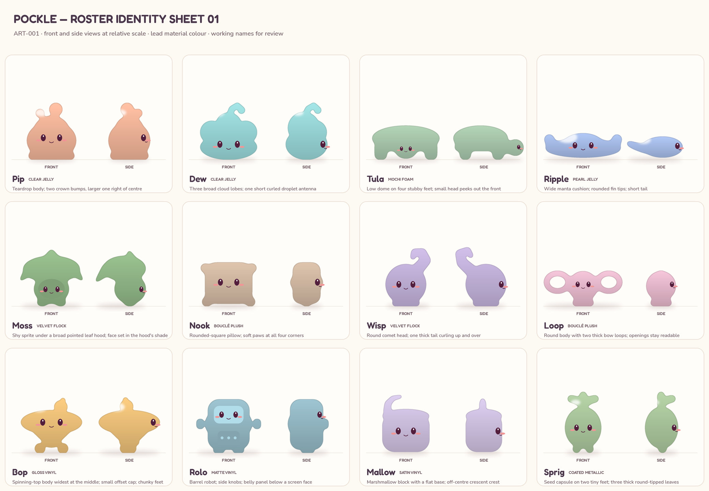
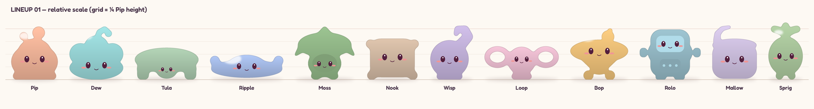
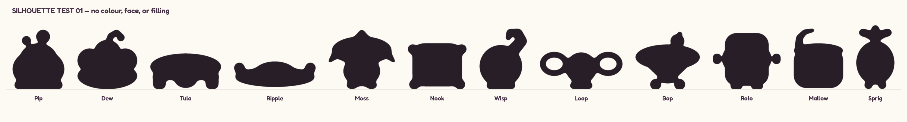

# Roster identity — ART-001 (Claude)

Concept sheets for the twelve characters in `../../CHARACTER_ROSTER.md`. They fix **silhouette, proportion, relative scale, and face placement** so models and finishes can be built against an agreed shape. They are flat-shaded concepts, not final art, and need the owner's review before Codex models the remaining characters.

| Sheet | What it checks |
| --- | --- |
| [identity-sheet-01.png](identity-sheet-01.png) | Front and side view of each character in its lead finish colour, with face placement |
| [lineup-01.png](lineup-01.png) | All twelve on one ground line; grid lines are ¼ of Pip's height |
| [silhouette-test-01.png](silhouette-test-01.png) | Flat black shapes with no colour, face, or filling. Every character must still be recognisable |

Regenerate with `python3 tools/build-roster-sheet.py` (Pillow; uses the UX-002 fonts when present, or set `POCKLE_FONTS`). Each character is a short, editable shape recipe in that script, in units of Pip's height.

## Identity rules

These are the features that make each character recognisable. A finish can change colour, surface, and handling, but **it must not change these**.

| Character | Height (Pip = 1) | Must keep | Face | Avoid |
| --- | --- | --- | --- | --- |
| **Pip** | 1.0 | Rounded teardrop body; **two separate bubble bumps** on the crown, larger one right of centre; flat foot | Centre, a little below half height | Bumps merging into one point; a pointed top |
| **Dew** | 0.9 | **Three broad cloud lobes** across the top; one short, thick curled antenna with a droplet tip | Low on the body, under the lobes | A smooth dome (it becomes Pip); a thin antenna that could snap |
| **Tula** | 0.6 | Low, wide dome shell on **four stubby feet**; small head peeking out at the front | On the head only | A tall shell; the head hidden under the shell in the front view |
| **Ripple** | 0.5 | Widest character: a flat **manta cushion** with rounded fin tips and a short tail | Centre front | Pointed fins; a tall body |
| **Moss** | 1.05 | Squat body **under a broad leaf hood** with a pointed tip and two drooping side tips | Set in a slightly darker **face recess** under the hood | Round, cloud-like hood lobes (overlaps Dew) |
| **Nook** | 0.8 | **Rounded square** pillow; soft paws at all four corners | Upper-centre | Becoming a plain rounded box (overlaps Mallow) |
| **Wisp** | 1.05 | Round comet head; **one tail that curls up and over the back** | Centre of the head | A tail as thick as the head (reads as a teapot) |
| **Loop** | 0.7 | Round body with **two thick bow loops**; the loop openings stay visible | Centre of the body | Thin loops; closing the holes |
| **Bop** | 1.0 | **Spinning-top** body: widest at mid-height, tapering below; small **off-centre** cap; chunky paired feet | On the wide middle band | A mushroom or bulb shape; a centred cap |
| **Rolo** | 1.0 | Upright **barrel robot**; side knobs; **screen face** above a belly panel | On the screen | Sharp robot corners or antennae |
| **Mallow** | 0.85 | Flat-based **marshmallow block**; one **off-centre crescent crest** | Centre front | Losing the crest (overlaps Nook) |
| **Sprig** | 1.05 | Seed capsule on two tiny feet; **three thick, round-tipped leaves** on a short stem | Centre | Thin or pointed leaves that read fragile |

**Closest pairs to watch:** Nook / Mallow / Rolo are all upright, boxy forms. They separate on corner paws, the crest, and side knobs + screen, so none of those can be dropped. Dew and Moss both have lobed tops: Dew's are round cloud lobes and Moss's hood is a pointed leaf.

**Scale on the shelf:** heights range from 0.5 (Ripple) to about 1.05. Shelf cubbies and portraits should frame each character to its own bounds, so the low, wide characters (Tula, Ripple, Loop) don't read as tiny. That framing is part of ART-005.

## Working names — check before shipping

These are design labels, and display names can change without touching saved IDs. Several are already well known in games, toys, or consumer brands. I'm not a lawyer, so treat this as a list to run a proper trademark search on (toys and games classes) before release, not as advice:

| Name | Why to check | Higher-risk? |
| --- | --- | --- |
| Bop | Similar to an established electronic toy brand | Yes |
| Mallow | Name of a character in a well-known video game series | Yes |
| Sprig | Name of a main character in an animated series | Yes |
| Rolo | A well-known confectionery brand | Yes |
| Nook | A well-known e-reader brand and a well-known game character | Medium |
| Dew, Ripple, Moss, Wisp, Pip, Loop, Tula | Common words or names in wide use; still search them | Lower |

If the owner wants to rename now, keep the IDs (`bop.gloss-vinyl`, etc.) and change only `DisplayName` in the catalog.

## Review of Codex's Moss and Bop studies (`codex/material-toys` @ `182f31b`)

The flock and vinyl surfaces both look right for their finish, and Bop's chunky feet and gloss are good. Both shapes drift from the roster's descriptions, though:

- **Moss** reads as a cloud or flower: the hood is three rounded lobes with no leaf point, which is the same idea as Dew's cloud lobes. Please give the hood a **pointed leaf tip at the top and two drooping, pointed side tips**, sit the body lower under it, and shade a **face recess** under the hood.
- **Bop** reads as a mushroom or onion bulb, because the body is widest near the top and the nub is centred. Please make it a **spinning top**: widest band at mid-height, a taper underneath down to the feet, and a **small cap set off-centre**.

Shapes and proportions to match are in the sheet above (front and side). Draft availability and reward pools stay unchanged until the owner approves.
