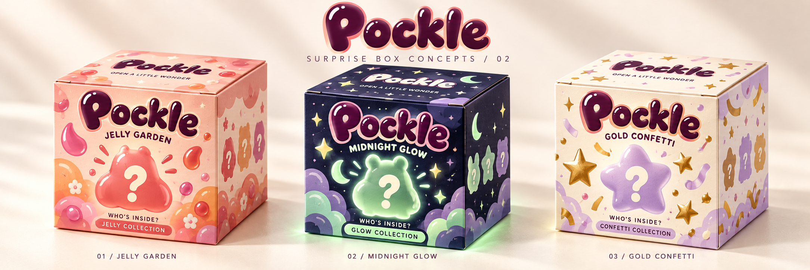
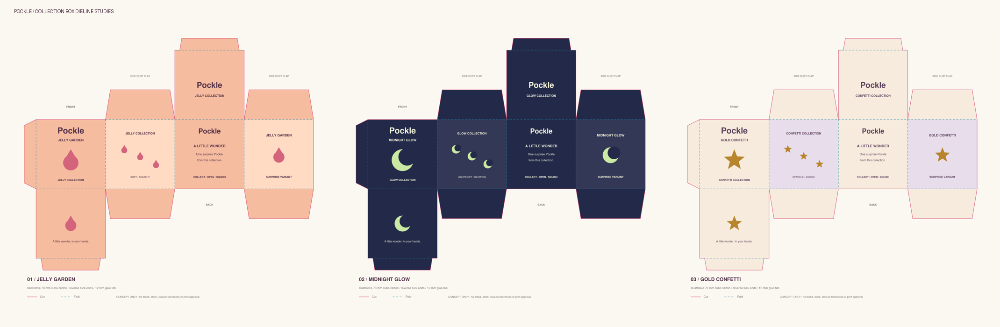
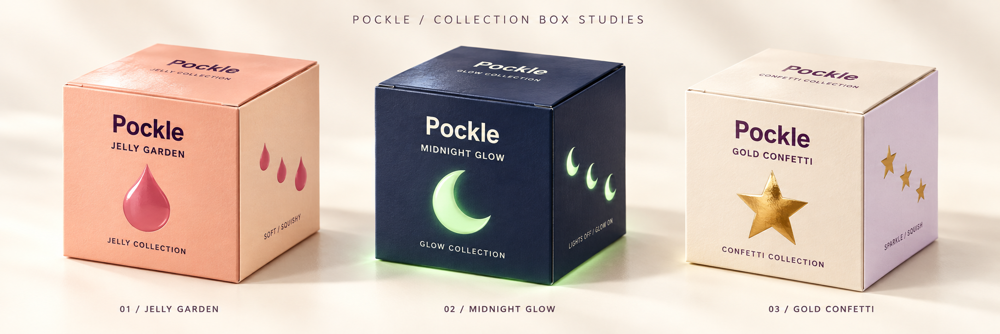

# Pockle collection-box studies

Three original collection packaging concepts use the same illustrative reverse-tuck cube carton. The latest visual direction adds a soft, inflated Pockle wordmark, mystery silhouettes, question marks, and playful collection patterns so the packaging reads as a surprise toy box. Packaging identifies the collection; the exact color and model stay a surprise until opening. These concepts are artwork for the app's virtual box reveal. They do not add rewards, purchases, or finished box animations to Unity.

| Collection | Palette | Collection symbol | Suggested finish |
| --- | --- | --- | --- |
| Jelly Garden | Peach, apricot, rose, plum | Jelly droplet | Matte carton with glossy droplet/lid accents |
| Midnight Glow | Indigo, cream, mint/lime | Crescent moon | Matte indigo with luminous mint accents |
| Gold Confetti | Warm ivory, lavender, gold | Gold stars | Matte carton with restrained gold foil |

## Revised surprise-box direction

This second mockup responds to the owner’s request for a squishy toy-like logo and a stronger surprise-box identity. It is a branding concept, not a finalized vector logo, texture atlas, or Unity-rendered opening. Jelly Garden is the intended first box to replace the reveal placeholder. Its lid should open, reveal Pip, and hand off to touch interaction after Pip settles; reduced motion uses a gentler, shorter opening. That reveal is planned for the next interaction pass.

## Structural dielines

The editable vector sheets retain the first-pass panel artwork; their shared structure is the template for the revised illustrations after the branding direction is settled. They are [Jelly Garden](jelly-garden-dieline.svg), [Midnight Glow](midnight-glow-dieline.svg), and [Gold Confetti](gold-confetti-dieline.svg). [The PDF](pockle-box-dielines.pdf) contains one full sheet per collection. PNG copies are supplied for convenient viewing.

Each net illustrates a 70 × 70 × 70 mm cube, a 12 mm side glue tab, side dust flaps, and opposite tuck-end closures. Magenta solid lines indicate the outer cut; cyan dashed lines indicate folds. SVG cut and fold overlays are separate groups. The labeled front, back, sides, and lid can guide a later 3D UV layout.

These are concept dielines, not press-ready files. They intentionally omit bleed, board thickness, closure allowances, printer registration, and supplier approval. The illustrative dimensions do not prescribe a physical product. For the app, use the panel artwork as textures on a reusable modeled box rather than including the technical linework or labels.

Regenerate the vector/PDF/PNG sheets with `python tools/build-box-concepts.py`. The helper uses ReportLab, PyMuPDF, and Pillow; those are concept-art tools, not Unity dependencies. Keep future variants in its shared theme table so the panel layout stays consistent.

## First-pass folded studies

The folded presentation was generated from the overview as an illustrative packaging mockup. Its surface finishes and perspective are visual direction; the editable SVG/PDF sheets are the source for panel placement.
