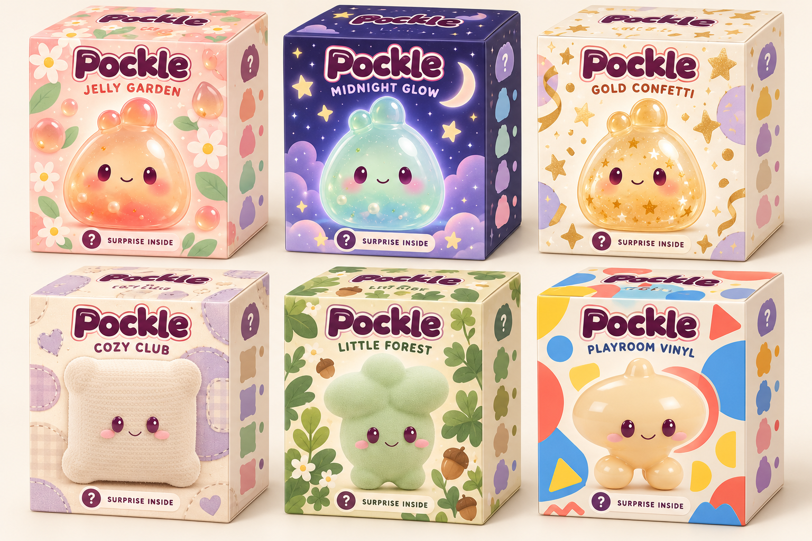

# Pockle collection boxes — character-led concepts 03

October 9, 2026. Owner request: preview collection packaging with the actual Pockle on it, preserving mystery, before building box meshes to replace the store's screenshot cutouts.

This generated concept board uses the existing Pip concept, Moss/Bop/Nook study renders, and squishy wordmark as visual references. It is a design preview, not a Unity render, production texture atlas, dieline, or new playable content. The draft character shapes still need ART-001 review. The names and palettes below are proposed packaging directions; reward pools and store offers remain unchanged. Midnight Glow remains a proposed glow edition, not a claim of implemented glow mechanics.

| Collection direction | Featured example | Print direction |
| --- | --- | --- |
| Jelly Garden | Peach jelly Pip | Peach/rose/mint, flowers, glossy droplets |
| Midnight Glow | Aqua/mint Pip | Indigo/lavender, stars, moons, luminous character artwork |
| Gold Confetti | Honey-gold confetti Pip | Cream/lavender, gold stars and confetti |
| Cozy Club | Oat bouclé Nook | Oat/lilac, fabric patches, stitches |
| Little Forest | Green flock Moss | Sage/cream, leaves, acorns |
| Playroom Vinyl | Apricot gloss Bop | Sky blue/coral/yellow, rounded geometric shapes |

## Mystery and product identity

The front shows a recognizable example toy with its eyes and smile unobscured. A separate question-mark badge and **Surprise inside** caption carry the mystery; the side shows possible color/finish silhouettes. Packaging identifies the collection, while the granted color/finish remains a surprise. The example artwork must not be treated as a promise of the exact awarded collectible. Pool membership and whether a box contains one character or multiple characters need to be settled when the offers are defined.

## Proposed mesh pass after visual review

- Reuse one compact paperboard carton shape across collections. Create a body with front/back/left/right/base surfaces, visible cream interior, board edge thickness, and a shallow bevel.
- Separate the rear-hinged lid and dust flaps with explicit pivot locations for the existing reveal animation. Keep printed front text upright and avoid reusing the front print on every face.
- Author clean flat front, side, rear, lid, and interior artwork from the reviewed direction and place it in a UV atlas. Do not crop the perspective concept render into mesh textures.
- Render store previews from the actual box mesh, sharing the artwork/material definitions with the opening scene. Coordinate this with Claude's HUD lane; the current screenshot grid can then be replaced by portraits of the mesh or a bounded preview renderer.
- Review closed and open cartons from front/side/back, reveal handoff, calm motion, transparency fade, and Android performance. Preserve inventory persistence before reveal and existing acquisition rules.

Only the concept board and notes are added in this pass. Box mesh/UV production and store/reveal integration await the owner's visual feedback as requested. No runtime code, Unity assets, settings, tests, or acquisition behavior changed.
