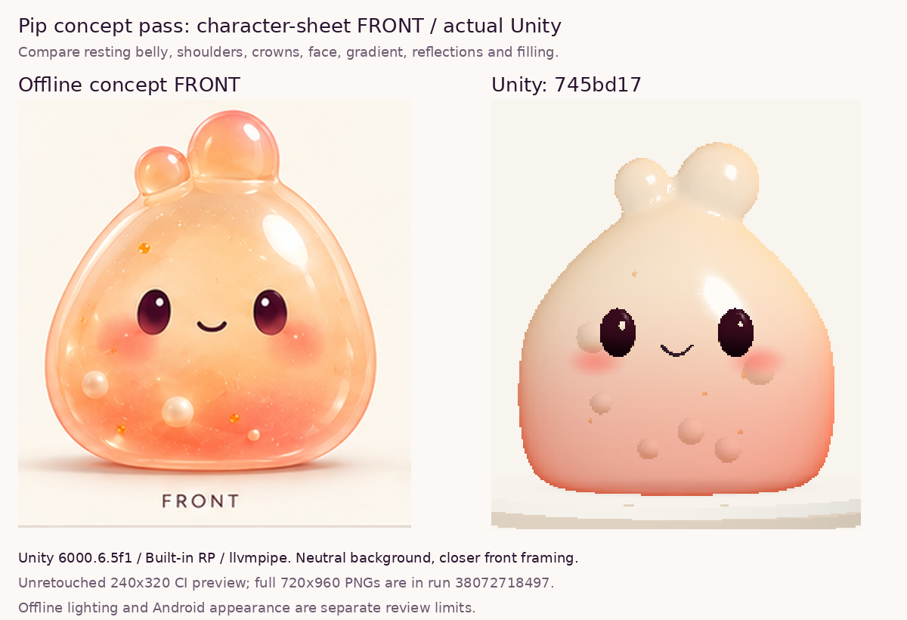
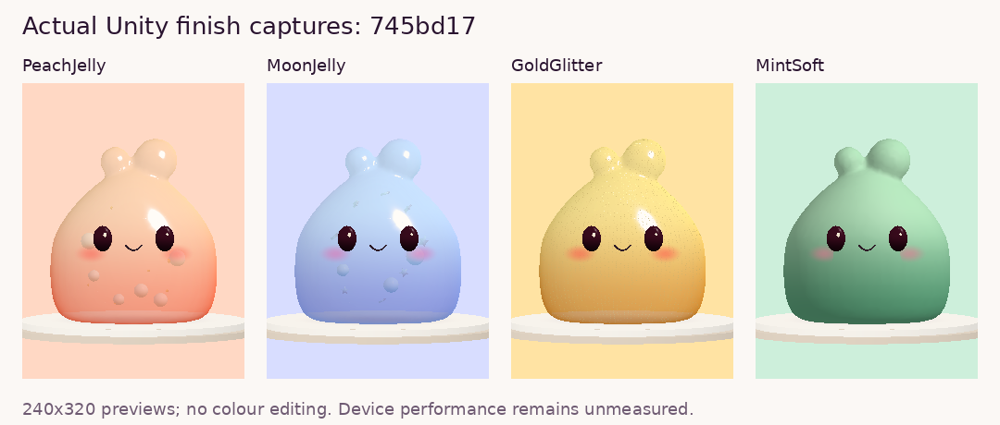
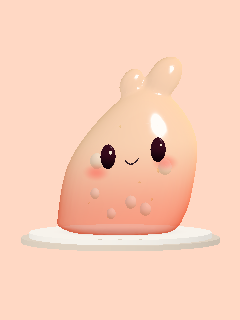

# Pip concept pass — actual Unity review

October 10, 2026. Tested code: [745bd17](https://github.com/calonchozuluaga/pockle/commit/745bd17e694de3693b14a6763dbe578286c9ad16), PR #11, branch `codex/pip-jelly-device-pass`. This review branch is evidence only; build the code branch.

Implements Claude's eight-point “Pip render vs. concept” note from [PR #12 handoff at 7521263](https://github.com/calonchozuluaga/pockle/blob/752126325a18932fa1a8843e3422345df465b1c3/docs/handoffs/claude.md). Compared with the preceding settled-belly pass: narrower shoulders, low broad body, round asymmetric crown lobes, lower/wider face, pale-peach/coral gradient, upper-right reflection, subdued rim, larger contained filling and wider soft shadow.

The left panel is the unretouched FRONT crop from `docs/concepts/pip-character-sheet-01.png`; the right is the actual neutral-background Unity capture. Each crop preserves aspect ratio apart from integer pixel rounding. Unity uses a closer, nearly level front camera than the previous review; previous captures should not be treated as identical-camera material comparisons. No AI render or colour editing is used.

The initial full-pass render `2c7e834` passed tests but read matte. Final `745bd17` restores a distinct upper-right softbox oval, keeps the hard left strip/bright outline subdued, and uses a milky pearl tint. Reviewed all four finishes, neutral front and grip views. Eyes/smile remain attached in the captured grip pose; Mint stays opaque; Moon retains stars and pearls; Gold retains microflake shading.

The concept remains more luminous and optically deep, with rounder lower corner transitions. The real-time single-pass approximation does not reproduce its offline refraction/scattering. This pass is ready for owner appearance/touch review, not declared visually accepted or equivalent to the concept.

## Evidence

- [CI run 38072718497, successful retry](https://github.com/calonchozuluaga/pockle/actions/runs/38072718497): **34/34 Unity tests**, 13 EditMode + 21 PlayMode, zero failed/skipped; portable/source/whitespace checks passed.
- First attempt stopped before Unity on a GameCI release lookup HTTP 403. Retried failed jobs without changing CI; retry succeeded.
- Unity **6000.6.5f1**, Built-in RP, **llvmpipe (LLVM 15.0.7, 256 bits)**. Six real captures decoded from CI log RGB/gzip previews.
- Published previews are **240×320**, enlarged with nearest-neighbour sampling on the comparison. [Full 720×960 PNG artifact](https://github.com/calonchozuluaga/pockle/actions/runs/38072718497/artifacts/11677970302) contains all four finishes, neutral front and grip view.
- Geometry: 2,868 logical / 3,126 exported vertices, 5,732 triangles; one watertight shell with .632-radius settled contact. FBX round-trip maximum position error .000000270.
- **543,482 portable assertions** across eleven suites, including shoulder/crown/face placement, settled contacts, deformation, picking and six-axis pearl containment. Final source checks: 66 files / three profiles / five assemblies / 142 GUIDs / zero failures. Shared mesh/material reuse and repeated finish restoration pass Unity tests.

Android packaging is still running at this publication. Phone startup, touch feel, colour space, appearance and CPU/GPU/GC cost remain owner checks in [PIP_JELLY_REVIEW.md](../../PIP_JELLY_REVIEW.md). Hosted software-renderer timings cannot establish Android performance. Claude's PR #12 UI remains separate.
