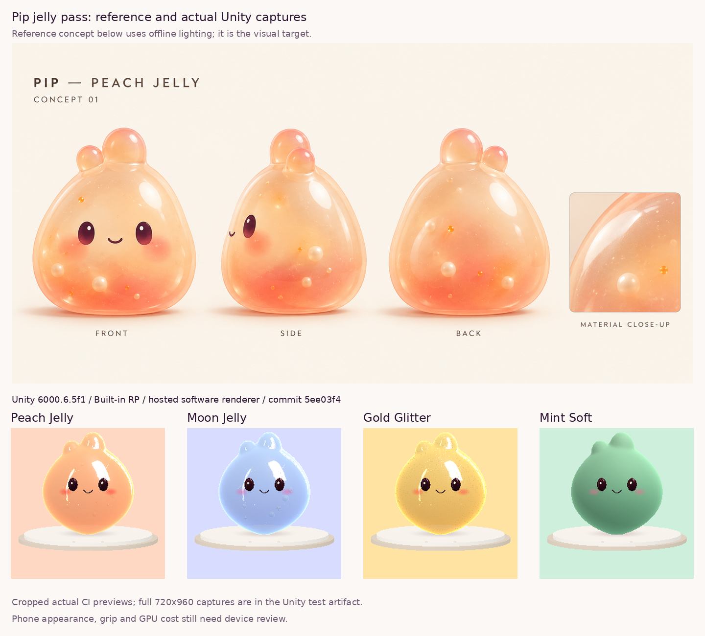

# Rounded jelly Pip — Unity review captures

Source code: `codex/pip-jelly-device-pass` at **5ee03f44fb35bd181685c73249cdcecbf1352809**. [CI run](https://github.com/calonchozuluaga/pockle/actions/runs/38066481266): **34/34 Unity tests passed** (EditMode 13/13, PlayMode 21/21, no skips); portable checks passed with **538,252 assertions**. Renderer: Unity 6000.6.5f1, Built-in RP, llvmpipe (LLVM 15.0.7, 256 bits).

The top panel is the existing offline concept. The four lower panels are cropped, enlarged previews decoded from the actual CI renderer's RGB output, without colour or material retouching. Original preview size: 240×320; full-resolution **720×960** PNGs for all four finishes and the grip pose are in the [Unity test artifact](https://github.com/calonchozuluaga/pockle/actions/runs/38066481266/artifacts/11675009359).

Visually inspected: rounded underside/small contact patch, four distinct finishes, glaze on Peach/Moon/Gold, opaque Mint, intact face anchors and the grip pose. The jelly edges are bright; the offline concept's fuller internal glow and filling depth remain reference targets, not claimed equivalence. Phone appearance, live Android startup, touch and CPU/GPU cost still require owner review. [Device checklist](../../PIP_JELLY_REVIEW.md).

This capture branch adds documentation only to the tested source commit. It does not alter the active test branch or restart its Android build.
