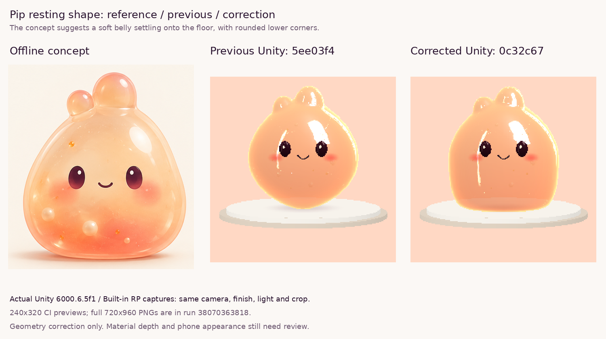
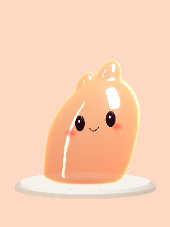

# Pip resting-shape correction — actual Unity review

Owner feedback: the concept has a naturally settled belly that implies weight and softness. The previous rounded underside narrowed to a .129-radius patch and read as pointed/balanced on its tip. This correction sculpts the lower volume into a broad shallow resting centre, with soft rounded lower corners and a .587-radius contact area (about 67% of body width).

Source: code branch `codex/pip-jelly-device-pass`, commit **0c32c672692f787d93ed4d8b550293064bab33fc**, [PR #11](https://github.com/calonchozuluaga/pockle/pull/11). This review branch contains documentation/images; build the code branch.

Left: front crop from the existing offline concept. Middle: actual previous Unity capture at 5ee03f4. Right: actual corrected Unity capture at 0c32c67. Both Unity crops use the same camera, Peach finish, lighting, source pixel bounds and displayed size. No material/colour retouch. These are 240×320 RGB previews from the CI log; enlarged pixels are preview resolution, not phone rendering quality.

[Unity run 38070363818](https://github.com/calonchozuluaga/pockle/actions/runs/38070363818) passed **EditMode 13/13 and PlayMode 21/21: 34/34, no skips**. GPU: llvmpipe (LLVM 15.0.7, 256 bits). The final 720×960 PNGs for Peach, Moon, Gold, Mint and the grip pose are in [unity-test-results](https://github.com/calonchozuluaga/pockle/actions/runs/38070363818/artifacts/11675953821). Hosted portable and source/whitespace checks also passed.

Local checks: **550,284 portable assertions**, 66 C# files / 3 profiles / 5 assemblies / 142 GUIDs / zero source failures; Blender FBX round-trip (20 parts, 2,939 welded / 3,180 exported vertices, 5,874 triangles, max error .000000254). The first correction produced 6,064 triangles and correctly failed the existing 6,000-triangle Unity budget; generator decimation was reduced without relaxing the test or changing the contact radius. Final run verifies the reduced export.

Visual findings: the narrow lower pole is gone; the body spreads across the support and rounds into its floor contact. Eyes/smile remain attached in the grip pose. All four finishes retain distinct appearance and the same revised resting geometry. The reference still has richer inner glow and filling depth; this correction targets the resting silhouette and does not claim a full material match.

At publication, Android packaging is still running. Phone startup/appearance, touch feel, motion and CPU/GPU/GC cost remain owner checks. Use Unity **6000.6.5f1**, Built-in RP, on the code branch. No engine/settings/packages/HUD/CI/material/physics changes were needed for this geometry correction. The prior Android collider/material pass remains included.
